<div align="center">

# 👑 RPG — Royal para Geeks

### O reino que vive dentro do seu grupo de Telegram

*Um RPG social retro-futurista que transforma a conversa do dia a dia em XP, níveis,
classes, casórios, raids contra chefões e disputas de quiz — tudo com **cartões 8-bit**
gerados pelo próprio jogo.*

<br>

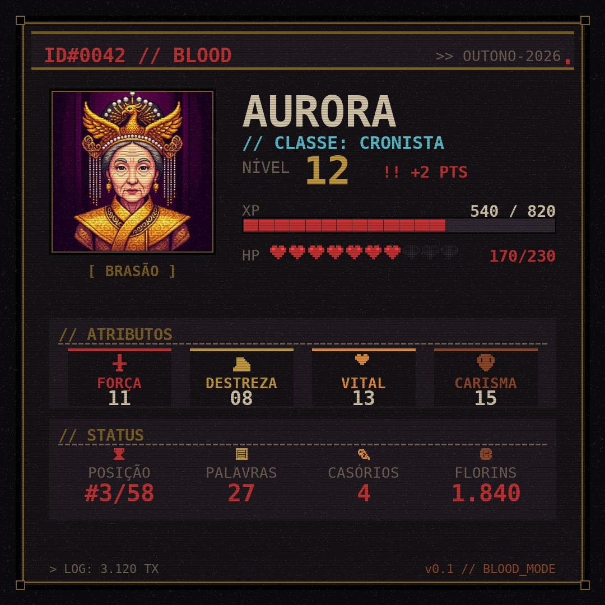

<br><br>

`💬 conversar dá XP` · `🏆 temporadas seguem as estações` · `💍 o bot te shippa` · `🐉 boss em grupo` · `🧠 quiz ao vivo` · `🪙 economia 100% interna`

<br>

> 🎮 **É um produto, não um setup.** O jogo roda sozinho no grupo: o bot observa as
> interações e devolve eventos, cartões e rankings. Ninguém precisa saber jogar —
> só conversar.

</div>

---

## 📖 Índice

| | | |
|---|---|---|
| 1. [O que é](#1-o-que-é) | 6. [Economia — Florins 🪙](#6-economia--florins-) | 11. [Quiz Real 🧠](#11-quiz-real-) |
| 2. [O ciclo do jogo](#2-o-ciclo-do-jogo) | 7. [Loja & Inventário](#7-loja--inventário) | 12. [Missões & Eventos](#12-missões--eventos) |
| 3. [Comandos](#3-comandos) | 8. [Palavra da Hora 🎯](#8-palavra-da-hora-) | 13. [Temporadas & Hall da Fama](#13-temporadas--hall-da-fama) |
| 4. [XP & Níveis](#4-xp--níveis) | 9. [Baú Real 🎁](#9-baú-real-) | 14. [Privacidade](#14-privacidade) |
| 5. [Atributos, Classes & HP](#5-atributos-classes--hp) | 10. [Boss Semanal 🐉](#10-boss-semanal-) | 15. [Galeria de cartões](#15-galeria-de-cartões) |

---

## 1. O que é

O **Royal para Geeks** é um bot de RPG **para grupos de Telegram**. Ele acompanha o que
acontece no chat e transforma isso num jogo de progressão contínua:

- 🗣️ **Cada mensagem vira XP.** Quem participa, sobe de nível.
- 🎭 **Cada jogador tem uma ficha:** classe, atributos, HP, inventário e um **Royal ID** público.
- 🎉 **O bot cria eventos sozinho:** Palavra da Hora, Baús, Boss semanal, casórios automáticos e quizzes.
- 🖼️ **Tudo vira imagem.** Perfis, rankings e pódios saem como **cartões 1080×1080** num estilo
  *8-bit distópico* (terminal CRT velho, ASCII, paleta ácida) — cada jogador ganha uma paleta única.
- 🪙 **Economia interna de florins.** Ganha-se jogando, gasta-se na loja do jogo. **O bot nunca cobra nada.**

<div align="center">
<table>
<tr>
<td align="center">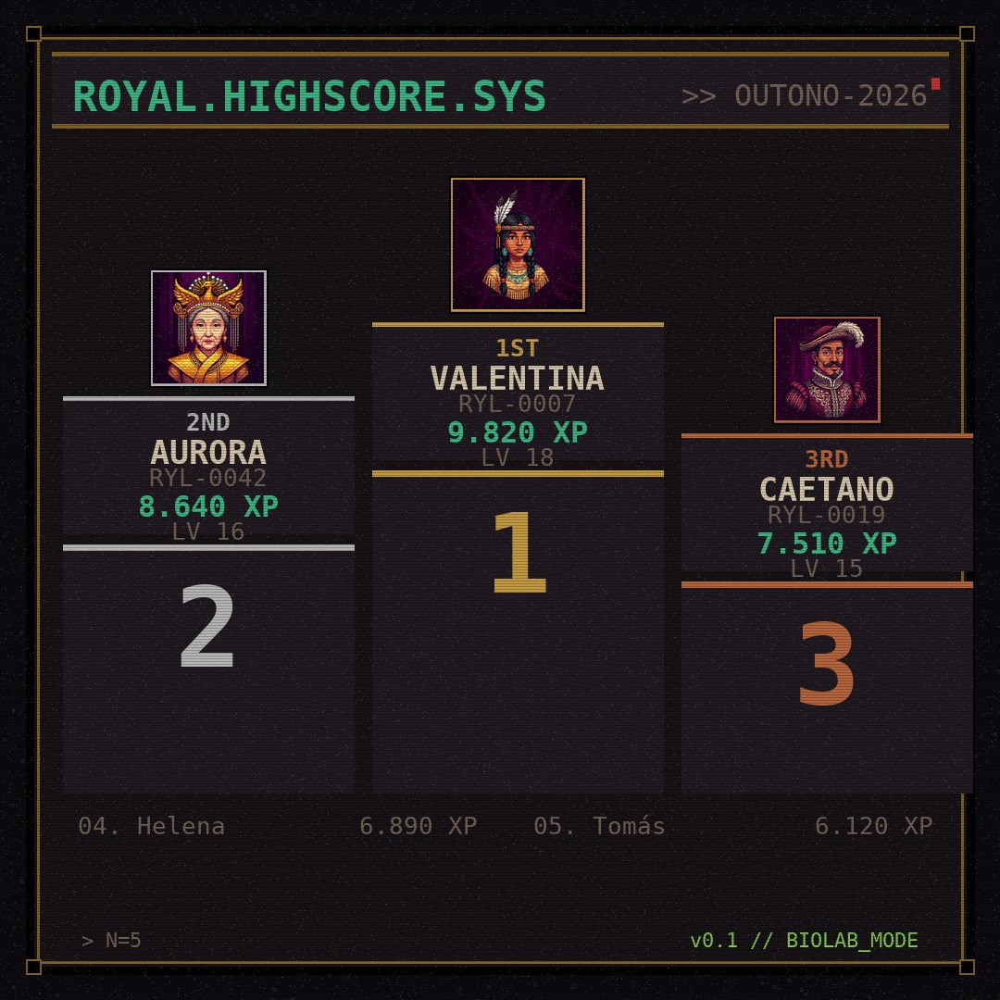<br><sub><b>Pódio da temporada</b></sub></td>
<td align="center">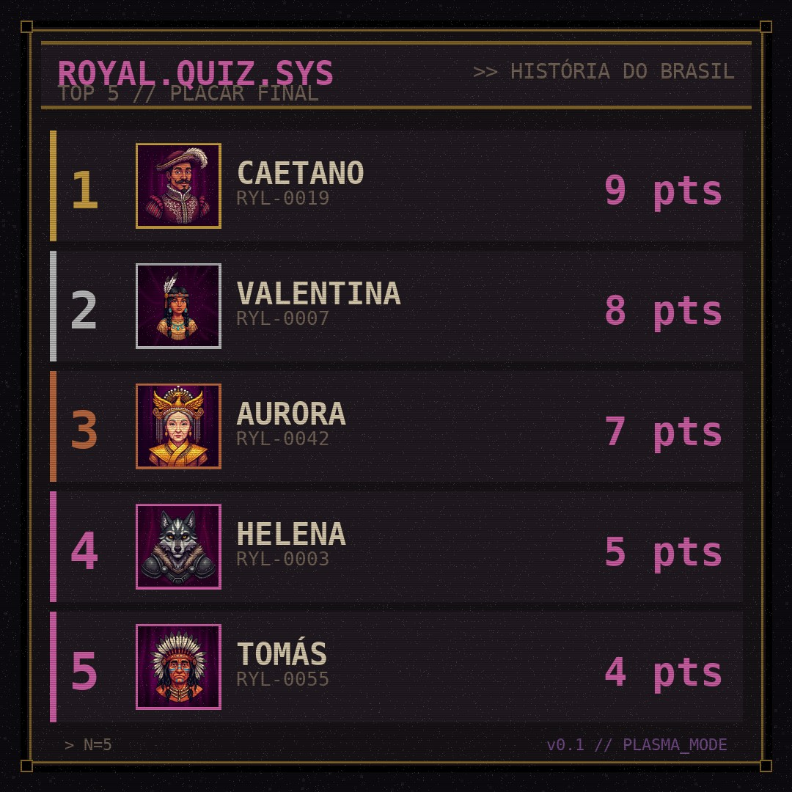<br><sub><b>Placar do Quiz</b></sub></td>
<td align="center">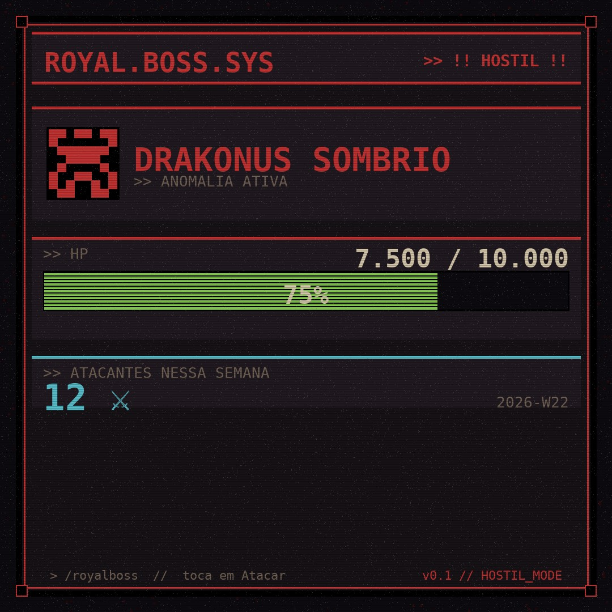<br><sub><b>Boss da semana</b></sub></td>
</tr>
</table>
</div>

---

## 2. O ciclo do jogo

```
        ┌──────────────────────────────────────────────────────────┐
        │                    VOCÊ CONVERSA NO GRUPO                  │
        └──────────────────────────────────────────────────────────┘
                                     │
              +2 XP/msg · +5 XP/reply · +3 XP/reação (cap diário)
                                     ▼
        ┌──────────────┐      sobe de    ┌──────────────────────────┐
        │  GANHA XP     │ ───────────▶   │  SOBE DE NÍVEL            │
        │  & FLORINS    │      nível      │  +3 pontos de atributo    │
        └──────────────┘                 └──────────────────────────┘
              │                                        │
              │ gasta na loja                          │ distribui em FOR/DES/VIT/CAR
              ▼                                        ▼
        ┌──────────────┐                 ┌──────────────────────────┐
        │  INVENTÁRIO   │                 │  FICHA MAIS FORTE        │
        │  equipa itens │ ───────────▶   │  + dano, + HP, + carisma  │
        └──────────────┘                 └──────────────────────────┘
                                     │
        eventos automáticos que o bot solta no grupo o dia inteiro:
                                     ▼
   🎯 Palavra da Hora   🎁 Baú Real   🐉 Boss semanal   💍 Casórios   🧠 Quiz   🎰 Caça-níquel
                                     │
                                     ▼
        ┌──────────────────────────────────────────────────────────┐
        │   RANKING DA TEMPORADA  →  HALL DA FAMA quando a estação vira │
        └──────────────────────────────────────────────────────────┘
```

**A cada estação do ano** o ranking zera, o Top 10 é eternizado no **Hall da Fama** e todo
mundo pode trocar de classe de novo. O jogo nunca "acaba".

---

## 3. Comandos

Tudo começa com **`/royal`** (o Hub) ou **`/royaltutorial`**. Lista completa:

### 🏰 Geral & Perfil
| Comando | O que faz |
|---|---|
| `/royal` | Abre o Hub/Terminal principal (menu de botões) |
| `/royalperfil [RYL-ID]` · `/royalficha` | Seu cartão de identidade. Com um ID, mostra o de outro nobre. |
| `/royalavatar` | Escolhe/troca o avatar (1× por temporada) |
| `/royalup` | Distribui pontos de atributo conquistados |
| `/royalclasse` | Escolhe/troca a classe (1× por temporada) |
| `/royaltutorial` · `/royalajuda` · `/help` | Tutorial guiado + manual completo |

### 💰 Economia & Itens
| Comando | O que faz |
|---|---|
| `/royalsaldo` | Quantos florins 🪙 você tem |
| `/royalloja` | Compra itens com florins |
| `/royalinventario` | Lista itens + equipar/usar |
| `/royalpresentear @user N` | Transfere N florins (10–5000); também via *reply* |

### 🎯 Eventos & Rankings
| Comando | O que faz |
|---|---|
| `/royalranking` | Top 10 da temporada (por XP) |
| `/royalpalavra` | Status da Palavra da Hora |
| `/royalboss` | Status/HP do boss da semana e dá o golpe |
| `/rquiz <tema>` | **(admin)** Abre um quiz ao vivo no grupo |
| `/royalmissoes` | 4 missões diárias → resgata XP + florins |
| `/royalevento` | Mostra o boost de XP ativo agora |
| `/royalconquistas` | Suas medalhas (desbloqueadas/bloqueadas) |

### 💍 Casórios (Shipper)
| Comando | O que faz |
|---|---|
| `/royalcasar` · `/querocasar` | **(admin)** Força um casamento agora |
| `/royalmeuscasorios` | Seu histórico + top pares |
| `/royalcasorios` | Ranking de casais do grupo |
| `/royalencalhar` · `/royaldesencalhar` | Sair / voltar pro shipper |

### 🔒 Conta & Privacidade
| Comando | O que faz |
|---|---|
| `/royalconfig` | Preferências (esconder do ranking, etc.) |
| `/royalprivacidade` | Esconder/mostrar nos rankings |
| `/royaldados` | Exportar ou apagar seus dados |
| `/royalsair` · `/royalvoltar` | Sair do jogo e voltar quando quiser — seu progresso fica todo guardado |
| `/royalgrupo` | Trocar o grupo Royal ativo na sua DM |
| `/royalativar` | **(admin)** Liga o bot no grupo |

> 🔗 **Modo inline:** digite `@nome_do_bot` em **qualquer** conversa para enviar seu cartão de perfil.

---

## 4. XP & Níveis

A curva de níveis é **quadrática suave**: cada nível pede um pouco mais de XP que o anterior.
O nível 1 começa em **0 XP** e exige **282 XP** para passar pro nível 2 — e a partir daí a
exigência cresce de forma constante.

### 💡 De onde vem o XP

| Ação | XP | Cooldown |
|---|---:|---|
| 💬 Mensagem normal | **+2** | 60 s |
| ↩️ Responder alguém | **+5** | 30 s |
| 😀 Reagir a uma mensagem | **+3** | até **10/dia** |
| 🎯 **Vencer** a Palavra da Hora | **+150** | — |
| 🎯 Participar (chegou perto) | **+30 a +75** | — |
| 🎯 Tentou e errou | **+5** (consolação) | — |
| 🎁 Baú Real (1º→5º) | **150 / 100 / 75 / 50 / 25** | — |
| 🐉 Atacar o boss | **2 + dano causado** | 5 min |
| 💍 Casamento formado | **+25** (os dois) | — |
| ❤️ Votar num casamento | **+2** | — |
| 📚 Tomo de Sabedoria (item) | **+100** | — |
| 🎰 Caça-níquel (trinca) | **+20** · jackpot **+100** | até 5/dia |

### ✖️ Bônus multiplicativos (se acumulam)

| Bônus | Efeito |
|---|---|
| 📜 Classe **Cronista** | **+10% de todo XP** |
| 💍 **Casado** (últimos 14 dias) | **+10% de todo XP** |
| 🎉 **Evento ativo** | **+50% a +100%** (veja §12) |

> **🧮 Exemplo de cálculo.** Uma **Cronista** que também está **casada** vence a Palavra da Hora:
> ```
> 150 XP  ×  1,10 (Cronista)  ×  1,10 (casada)  ≈  181 XP
> ```
> E se isso cair num fim de semana (+50%): `181 × 1,5 ≈ 272 XP` numa única vitória. 🚀

### ⬆️ Quando você sobe de nível
- 🔔 O grupo te parabeniza com uma menção (sem floodar a DM de ninguém).
- 🎁 Você ganha **3 pontos de atributo** para gastar em `/royalup`.

---

## 5. Atributos, Classes & HP

### 🎲 Atributos (todos começam em **5**)

| Sigla | Nome | Para que serve |
|---|---|---|
| **FOR** | Força | Dano no boss: `FOR + sorte(1–10)` |
| **DES** | Destreza | Agilidade (esquiva/cooldowns futuros) |
| **VIT** | Vitalidade | **+10 de HP máximo** por ponto |
| **CAR** | Carisma | Peso no shipper / casórios |

> **Atributo efetivo** = base **+** bônus da classe **+** bônus do equipamento.

### 🎭 Classes (troca 1× por temporada)

| Classe | Bônus |
|---|---|
| 👑 **Monarca** | +20% de HP base |
| 🗡️ **Cavaleiro** | +2 FOR |
| 🌹 **Cortesã** | +2 CAR |
| 🧙 **Bruxo** | +2 DES |
| 📜 **Cronista** | +10% de XP |
| 🗝️ **Bobo** | +50% de florins |

### ❤️ HP máximo

```
HP máx = ( 50  +  VIT × 10  +  nível × 5 )  ×  ( 1,20 se Monarca, senão 1,0 )
```

> **🧮 Exemplo.** Um **Monarca** nível 12 com **VIT 13**:
> ```
> ( 50 + 13×10 + 12×5 ) × 1,20  =  ( 50 + 130 + 60 ) × 1,20  =  240 × 1,20  =  288 HP
> ```
> O mesmo personagem, sem ser Monarca, teria **240 HP**. O HP volta a 100% com a **Poção de Vigor 🧪**.

---

## 6. Economia — Florins 🪙

A única moeda é o **florim**. Não há compra com dinheiro real, item pago, nem assinatura —
**o bot jamais cobra nada**. Tudo gira dentro do jogo.

| | Florins |
|---|---:|
| 💰 Saldo inicial | **50** |
| 🎯 Vencer a Palavra | **+50** |
| 🐉 Matar o boss (em grupo) | **500 no total**, divididos *proporcionalmente ao dano* |
| 🎁 Baú Real | **+10** por posição |
| 🎰 Caça-níquel (trinca) | **+30** · jackpot **+200** |
| 🗝️ Classe **Bobo** | **todos os ganhos × 1,5** |

> **🧮 Exemplo.** Um **Bobo** vence a Palavra: `50 × 1,5 = 75 🪙`. Mata o boss e teria 80 de
> recompensa: `80 × 1,5 = 120 🪙`. O florim só sai do bolso na **loja** ou em **`/royalpresentear`**.

<div align="center">
<table>
<tr>
<td align="center">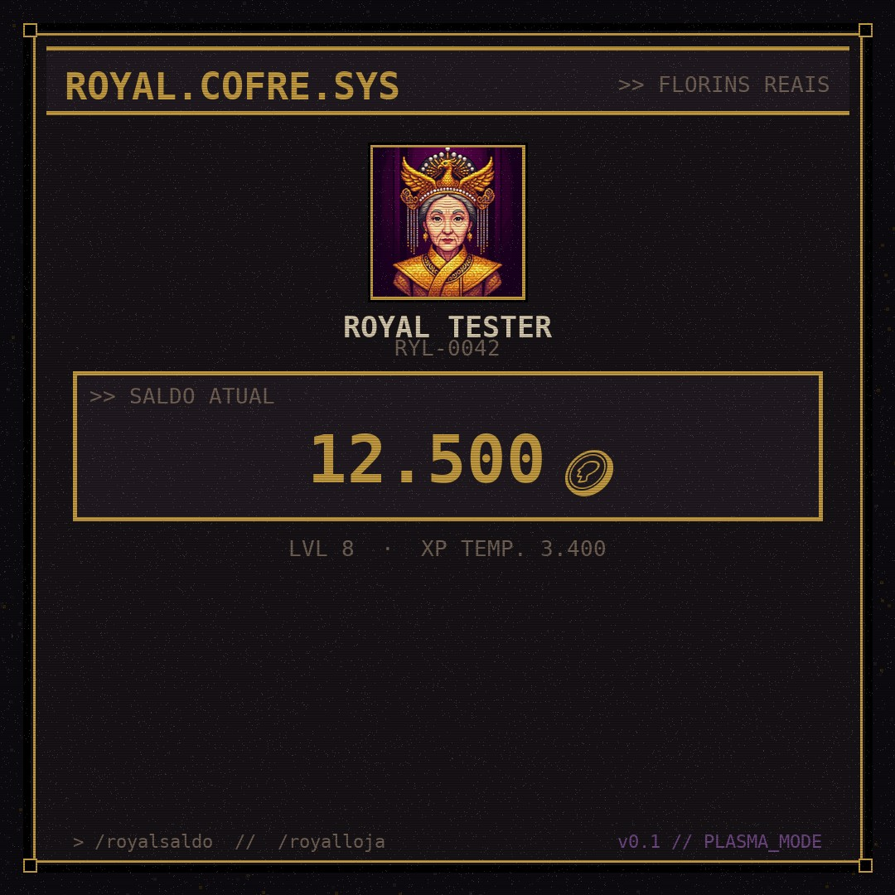<br><sub>saldo comum</sub></td>
<td align="center">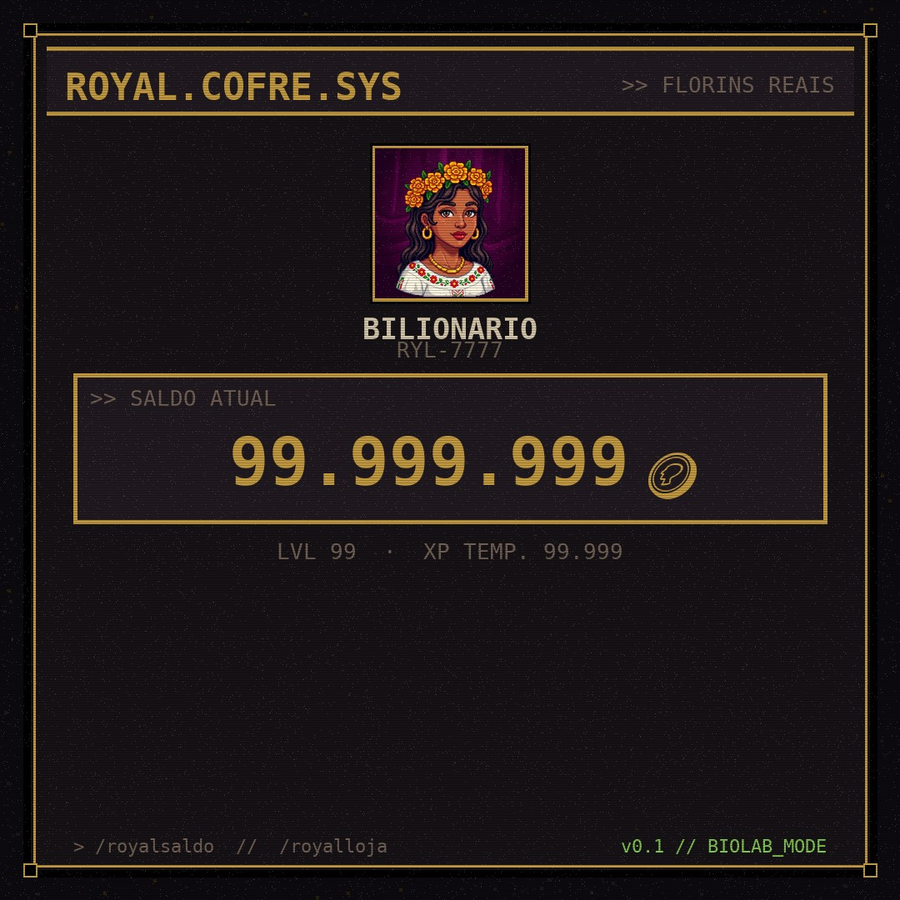<br><sub>arca cheia</sub></td>
<td align="center">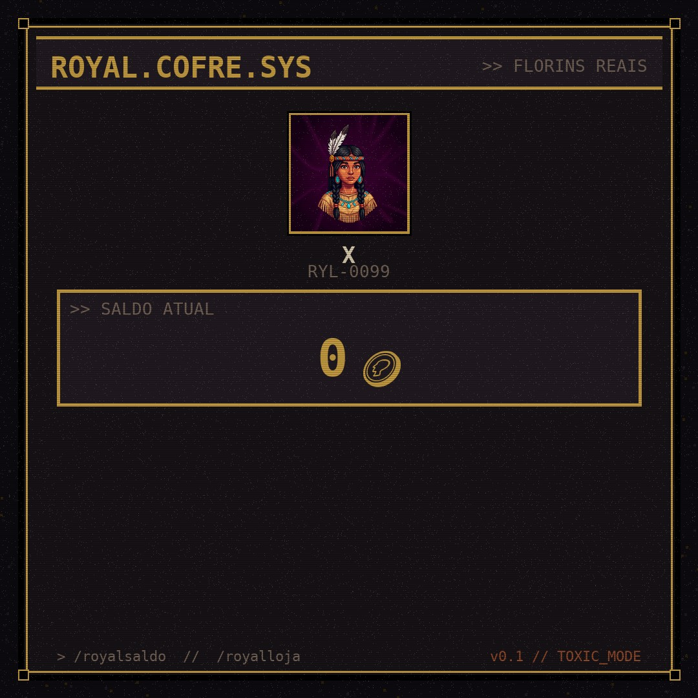<br><sub>falido</sub></td>
</tr>
</table>
</div>

---

## 7. Loja & Inventário

| Item | Preço | Tipo | Efeito |
|---|---:|---|---|
| 🧪 Poção de Vigor | 50 🪙 | consumível | Restaura **todo** o HP |
| 🥾 Botas Ágeis | 150 🪙 | equipar | +2 DES |
| 🗡️ Espada de Ferro | 200 🪙 | equipar | +3 FOR |
| 🛡️ Armadura de Couro | 200 🪙 | equipar | +2 VIT (= +20 HP) |
| 💍 Anel da Corte | 250 🪙 | equipar | +2 CAR |
| 📚 Tomo de Sabedoria | 300 🪙 | consumível | **+100 XP** na hora |
| 👑 Coroa Decorativa | 500 🪙 | cosmético | Aparece no perfil |

> Só **1 equipamento de cada tipo** fica ativo por vez (espada, armadura, botas, anel).

<div align="center">
<table>
<tr>
<td align="center">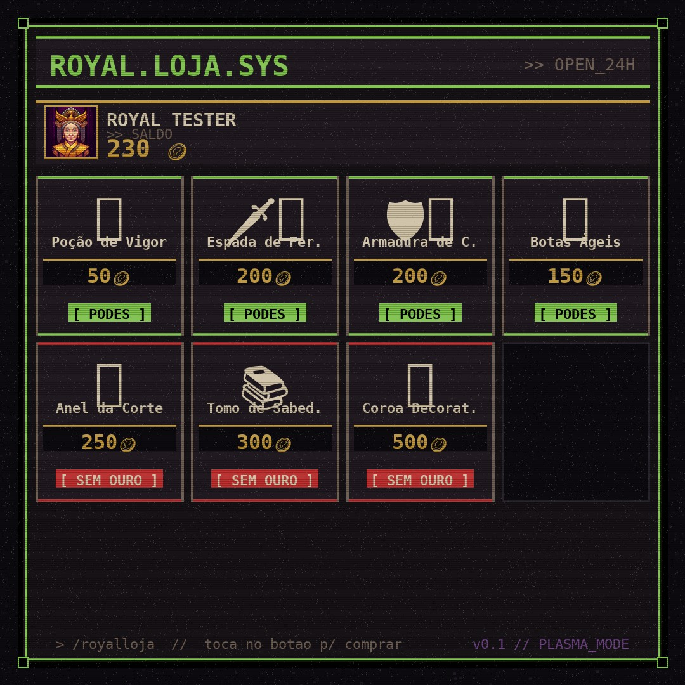<br><sub><b>A loja</b></sub></td>
<td align="center">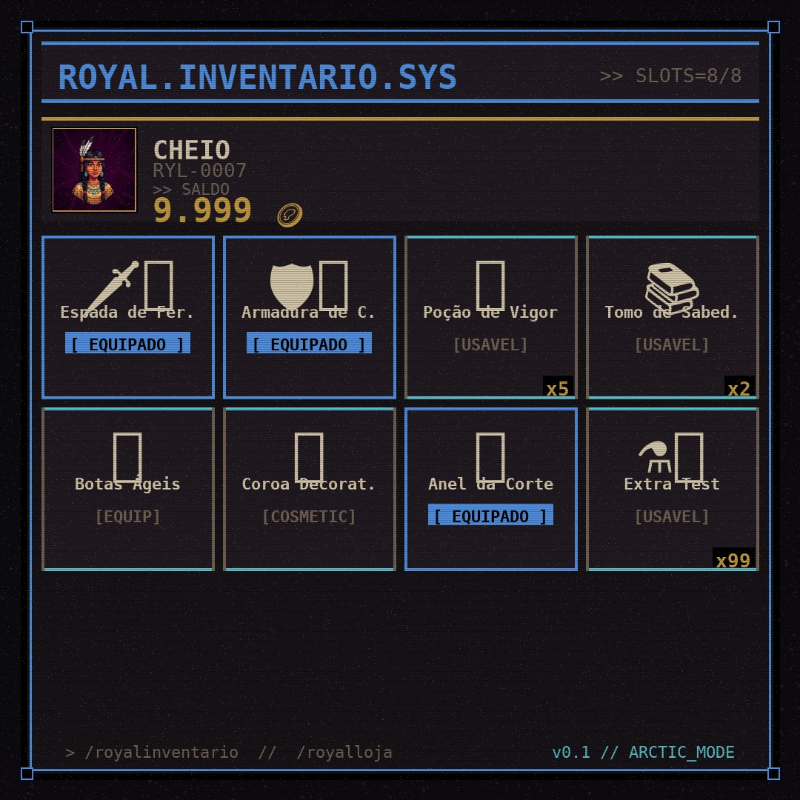<br><sub><b>Inventário cheio</b></sub></td>
</tr>
</table>
</div>

---

## 8. Palavra da Hora 🎯

De tempos em tempos o bot solta um desafio de palavra no grupo. **O 1º a digitar a resposta certa vence.**

| Parâmetro | Valor |
|---|---|
| ⏱️ Janela aberta | **5 / 7 / 10 min** (sorteado, ± jitter) |
| 🧩 Tipos | Anagrama · Letras Faltando · **Charada** (~25% das vezes) |
| 🏆 Prêmio do vencedor | **150 XP + 50 🪙** |
| 🙌 Quem chegou perto | **30 a 75 XP** |
| 😅 Quem tentou e errou | **5 XP** (consolação) |
| 🛡️ Anti-spam | **3 s** de cooldown entre tentativas |

> 🧠 As palavras vêm de um banco que se **renova sozinho** com a *inteligência royal* (veja §11),
> então o jogo quase nunca repete o mesmo desafio.

<div align="center">
<table>
<tr>
<td align="center">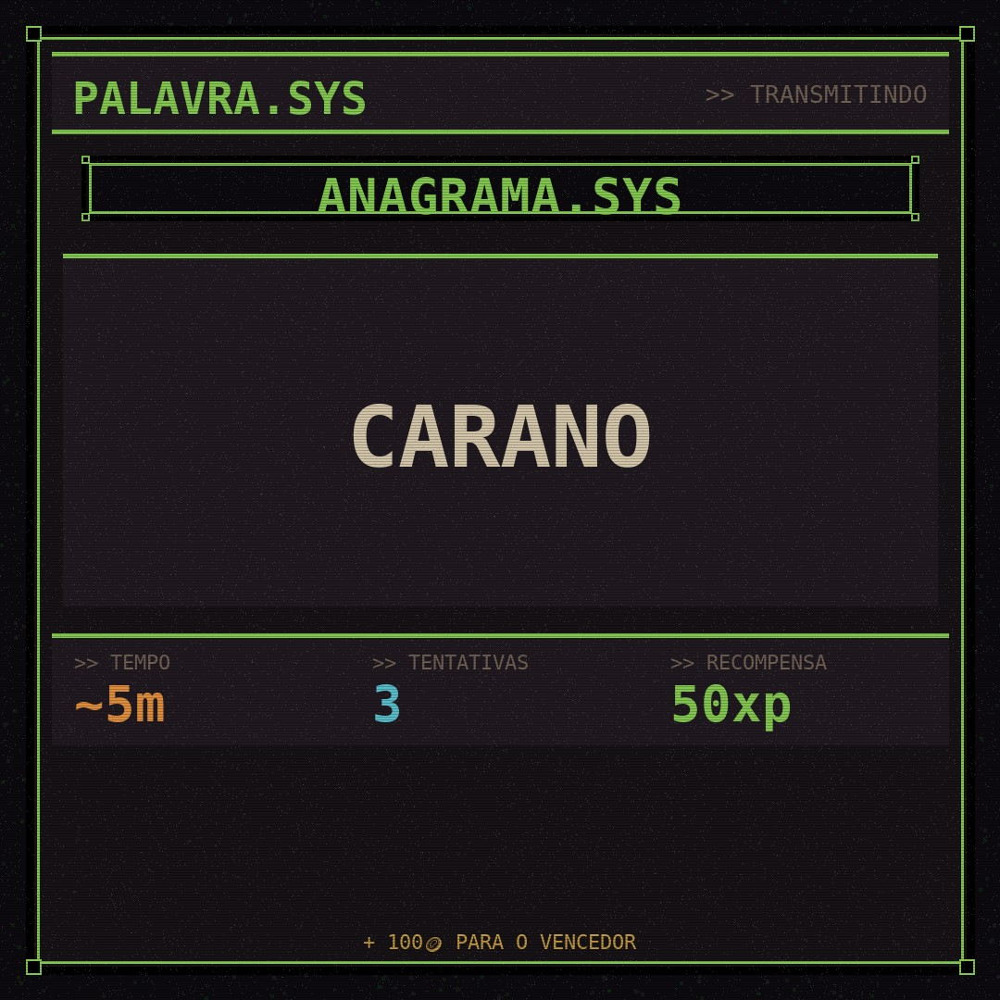</td>
<td align="center">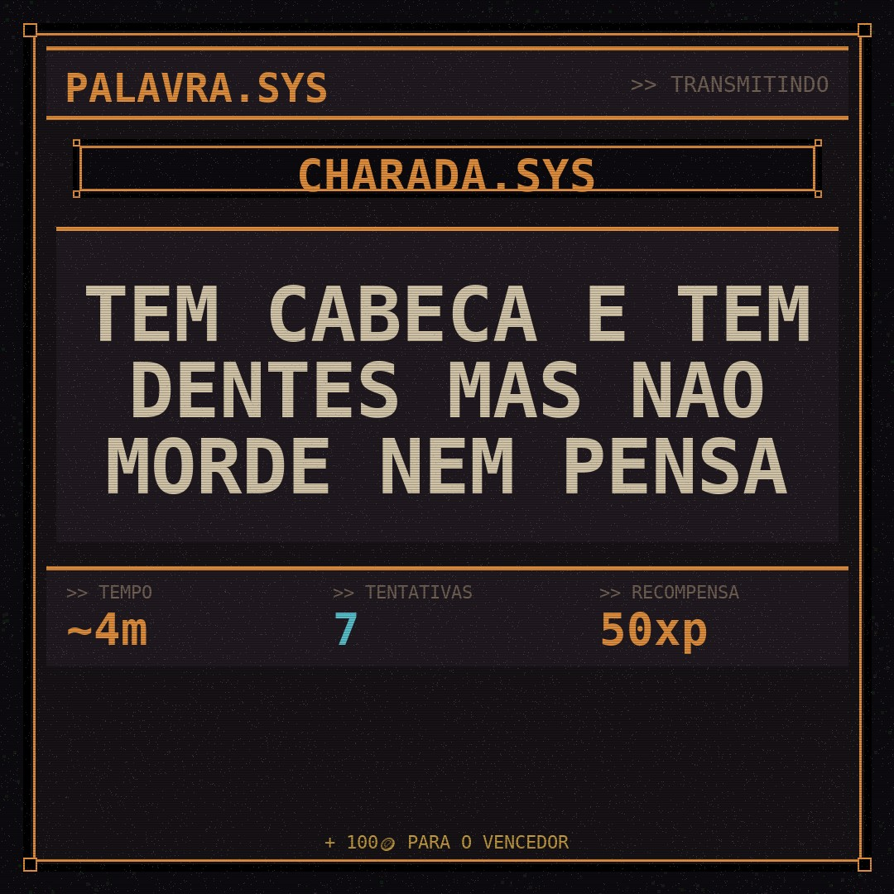</td>
<td align="center">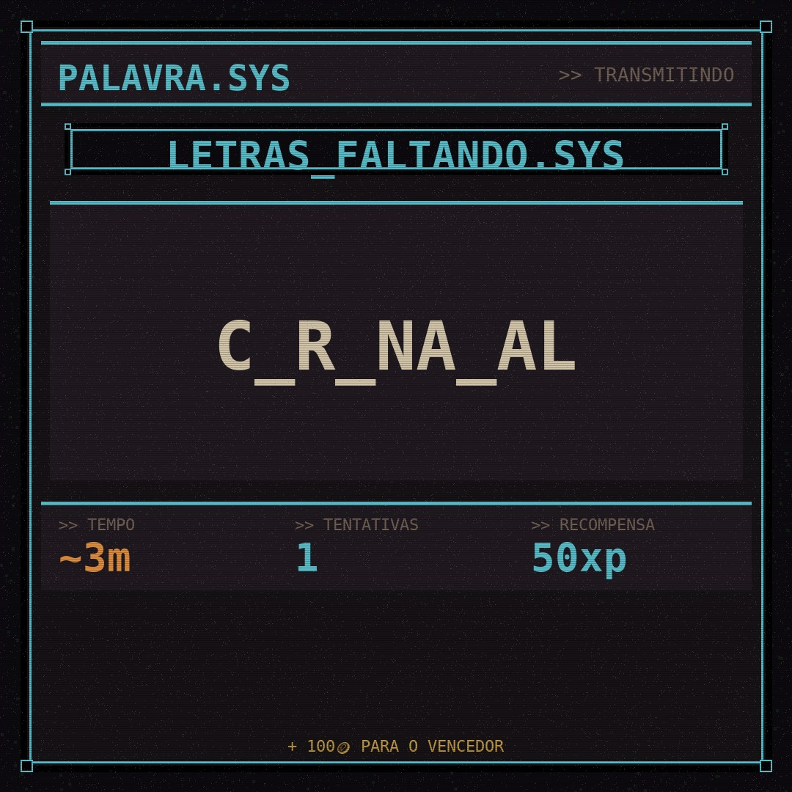</td>
</tr>
</table>
</div>

---

## 9. Baú Real 🎁

**30 minutos depois** de cada Palavra resolvida, um baú aparece no grupo. Os **5 primeiros** a
clicar abrem um slot (1 slot por pessoa).

| Posição | XP | 🪙 |
|:---:|---:|---:|
| 🥇 1º | 150 | 10 |
| 🥈 2º | 100 | 10 |
| 🥉 3º | 75 | 10 |
| 4º | 50 | 10 |
| 5º | 25 | 10 |

O baú fica **30 min** disponível. Reflexo conta. ⚡

---

## 10. Boss Semanal 🐉

Todo **domingo às 20h** nasce um chefão e o **grupo inteiro ataca junto** — é cooperativo.

| Mecânica | Como funciona |
|---|---|
| ❤️ HP do boss | `máx( 500 , nº de jogadores × 200 )` — escala com o grupo |
| ⚔️ Seu dano | `FOR efetivo + sorte(1–10)` |
| ⭐ XP por golpe | `2 + dano` |
| ⏱️ Cooldown | **5 min** entre os seus ataques |
| 🪙 Loot da morte | **500 florins** divididos *proporcionalmente ao dano de cada um* |

> **🧮 Exemplo.** Grupo de **30 jogadores** → boss com `30 × 200 = 6.000 HP`. Um Cavaleiro com
> **FOR 15** causa de **16 a 25** de dano por golpe. Quem mais bate, mais leva do butim. 💰

<div align="center">
<table>
<tr>
<td align="center">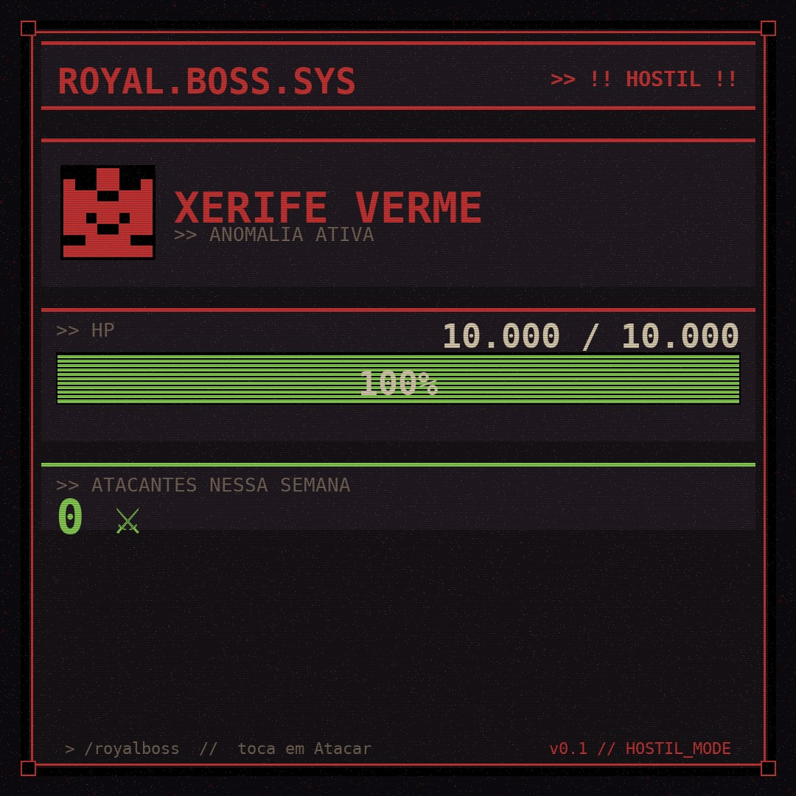<br><sub>HP cheio</sub></td>
<td align="center"><br><sub>75%</sub></td>
<td align="center">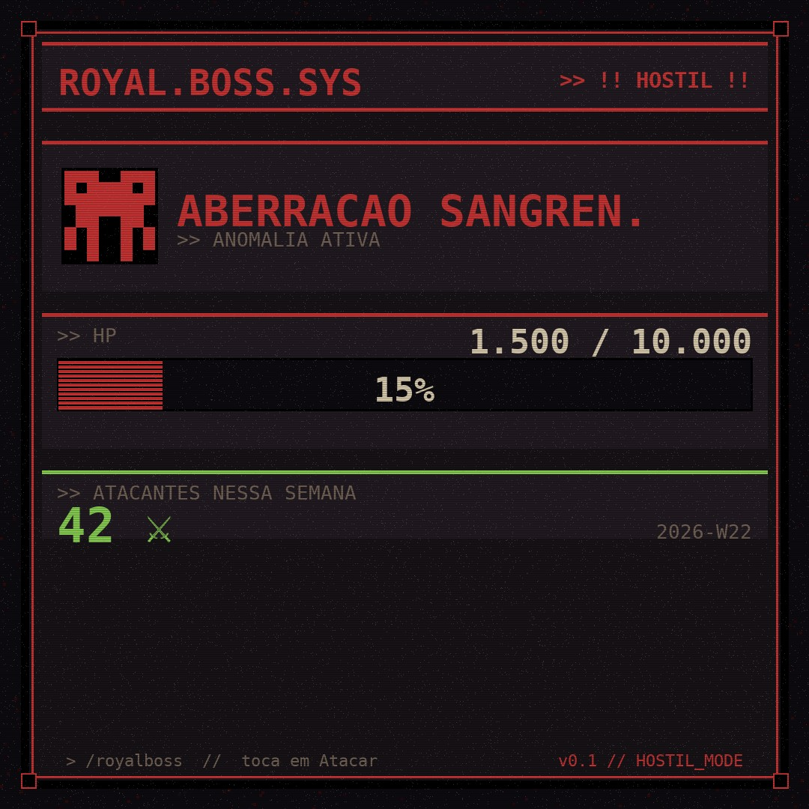<br><sub>quase lá</sub></td>
</tr>
</table>
</div>

---

## 11. Quiz Real 🧠

Um **administrador** abre um quiz ao vivo com **`/rquiz <tema>`** e escolhe **5 ou 10 perguntas**.
A *inteligência royal* monta a rodada sobre o tema pedido e o grupo responde em **enquetes nativas
do Telegram**.

| Etapa | O que acontece |
|---|---|
| 1️⃣ Inscrição | Sai uma janela com botão **Entrar** — só inscritos pontuam |
| 2️⃣ Rodada | Cada pergunta vira uma enquete (1 resposta certa, ~30 s) |
| 3️⃣ Placar | No fim, um **cartão Top-5** mostra quem mais acertou |
| 🧹 Limpeza | As enquetes somem e **fica só o pódio** — que se apaga sozinho depois |

> 🎈 O quiz é **por diversão**: não dá XP nem mexe no ranking da temporada. É um show à parte,
> que não polui o grupo.

<div align="center">

</div>

---

## 12. Missões & Eventos

### 🗺️ Missões diárias (`/royalmissoes`)

| Missão | Meta | Recompensa |
|---|---|---|
| 💬 Mande mensagens no reino | 20 | **60 XP + 30 🪙** |
| 🎯 Acerte 1 Palavra da Hora | 1 | **80 XP + 50 🪙** |
| 🐉 Acerte o boss da semana | 3× | **50 XP + 40 🪙** |
| 👍 Reaja a mensagens | 5 | **30 XP + 20 🪙** |

> ✅ Fechando as quatro num dia: **220 XP + 140 🪙**.

### 🎉 Eventos de XP (`/royalevento`)

| Evento | Boost |
|---|---|
| 📅 **Todo fim de semana** | **+50% XP** |
| 🎆 Reveillon Real (31/12–01/01) | **×2** |
| 🎄 Natal dos Nobres (24–25/12) | **×2** |
| 🔥 Festa Junina Real (23–24/06) | ×1,5 |
| 🎃 Noite Sombria (31/10) | ×1,5 |
| ❤️ Dia dos Namorados (12/06) | ×1,5 |

### 🎰 Caça-níquel
Mande o emoji 🎰 no grupo: se a **trinca** bater, leva **20 XP + 30 🪙**; o jackpot **7️⃣7️⃣7️⃣**
dobra para **100 XP + 200 🪙**. Até **5 prêmios por dia**.

### 🏅 Conquistas (`/royalconquistas`)

| Medalha | Como desbloquear |
|---|---|
| 🎯 Primeiro Acerto | Acertar a 1ª Palavra |
| 🏹 Caçador de Palavras | 10 Palavras |
| ⚡ Mestre das Letras | 100 Palavras |
| 🐉 Matador de Titãs | Participar de 1 boss kill |
| ⭐ Veterano · 🌟 Lendário · 👑 Imortal | Níveis 10 · 25 · 50 |
| 💍 Coração da Corte | Primeiro casório |
| 🎁 Generoso | Presentear outro jogador |

---

## 13. Temporadas & Hall da Fama

O calendário segue as **estações do hemisfério sul**:

| Estação | Período |
|---|---|
| 🌸 Primavera | 22/09 → 20/12 |
| ☀️ Verão | 21/12 → 19/03 |
| 🍂 Outono | 20/03 → 20/06 |
| ❄️ Inverno | 21/06 → 21/09 |

Quando a estação vira, o jogo automaticamente:
1. 🏆 Eterniza o **Top 10** no **Hall da Fama**.
2. 🔄 Zera o XP da temporada de todo mundo (o XP total/histórico continua).
3. 📣 Publica o Hall da Fama no grupo.
4. 🎭 Libera uma nova troca de classe.

<div align="center">

</div>

---

## 14. Privacidade

Privacidade é parte do design. **O número de usuário do Telegram nunca vaza** — em lugar nenhum.

- 🆔 **Royal ID** (`RYL-XXXX`): o **único** identificador público de cada jogador, exclusivo por grupo.
- 🕶️ **Anonimização automática:** se um jogador nunca falou ou pediu sigilo, ele aparece como
  `ANON-NN` — nunca como um número real.
- 🔒 **`/royalprivacidade`:** esconde você do ranking público e/ou usa só o brasão procedural no
  lugar da sua foto.
- 📦 **`/royaldados` (LGPD/GDPR):** **exporta** tudo o que o jogo guarda sobre você, ou **apaga**
  seus dados quando quiser.
- 🙅 **Sem DM proativa:** avisos (level-up, conquistas) são postados **no grupo**, mencionando você —
  o bot não enche sua caixa privada.

---

## 15. Galeria de cartões

Todos os cartões abaixo foram **gerados pelo próprio jogo** (estilo *8-bit distópico*, com
ruído de TV, scanlines e vinheta). Cada jogador recebe uma paleta consistente derivada do seu Royal ID.

<div align="center">
<table>
<tr>
<td align="center"><br><sub><b>Perfil</b></sub></td>
<td align="center">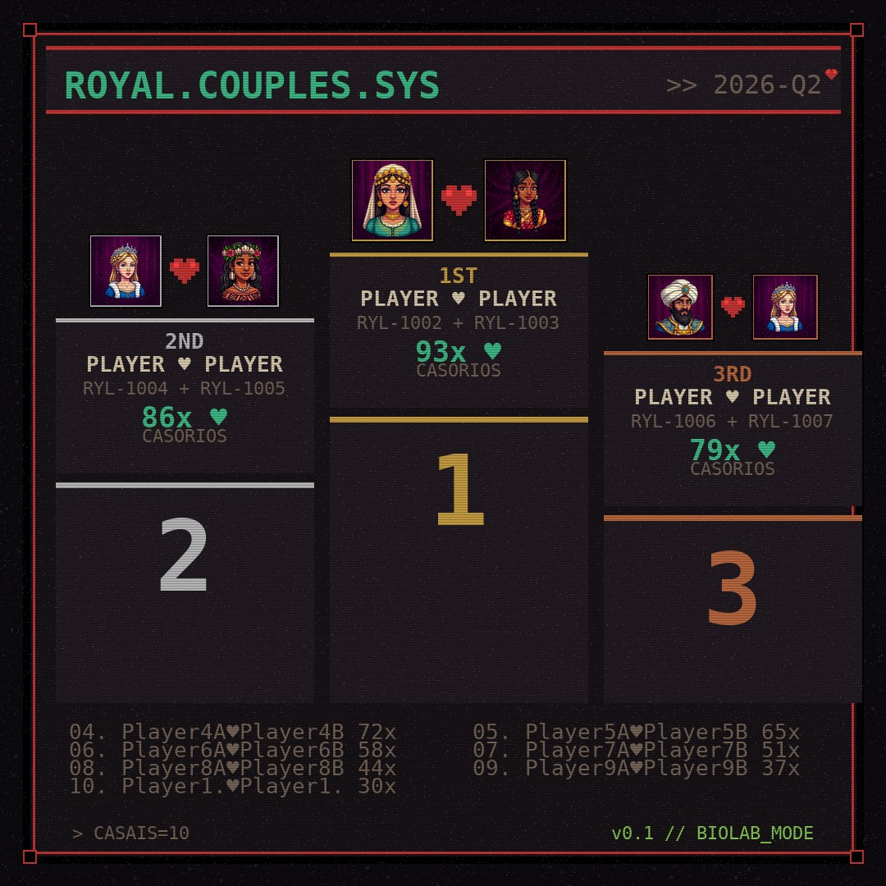<br><sub><b>Ranking de casais</b></sub></td>
<td align="center">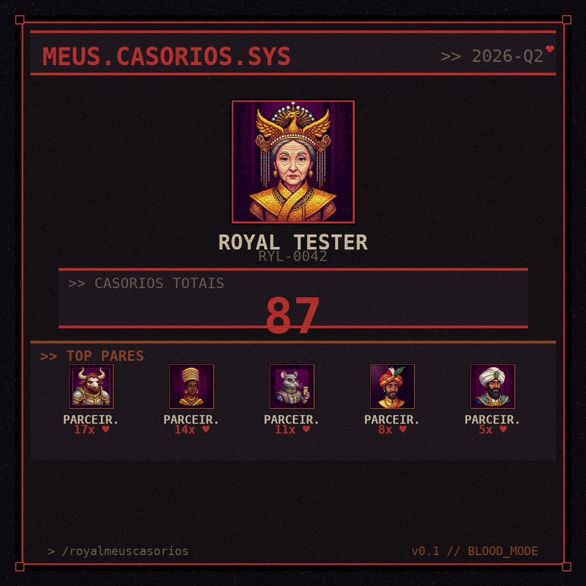<br><sub><b>Meus casórios</b></sub></td>
</tr>
<tr>
<td align="center">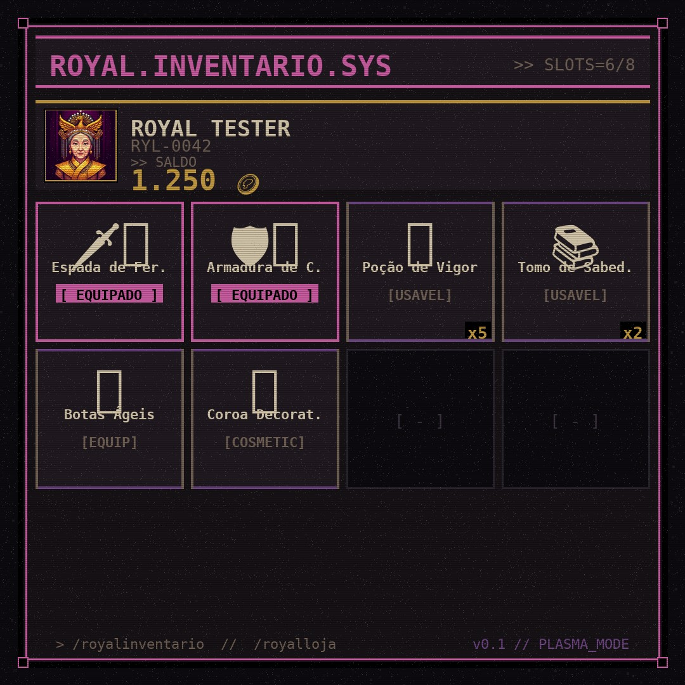<br><sub><b>Inventário</b></sub></td>
<td align="center">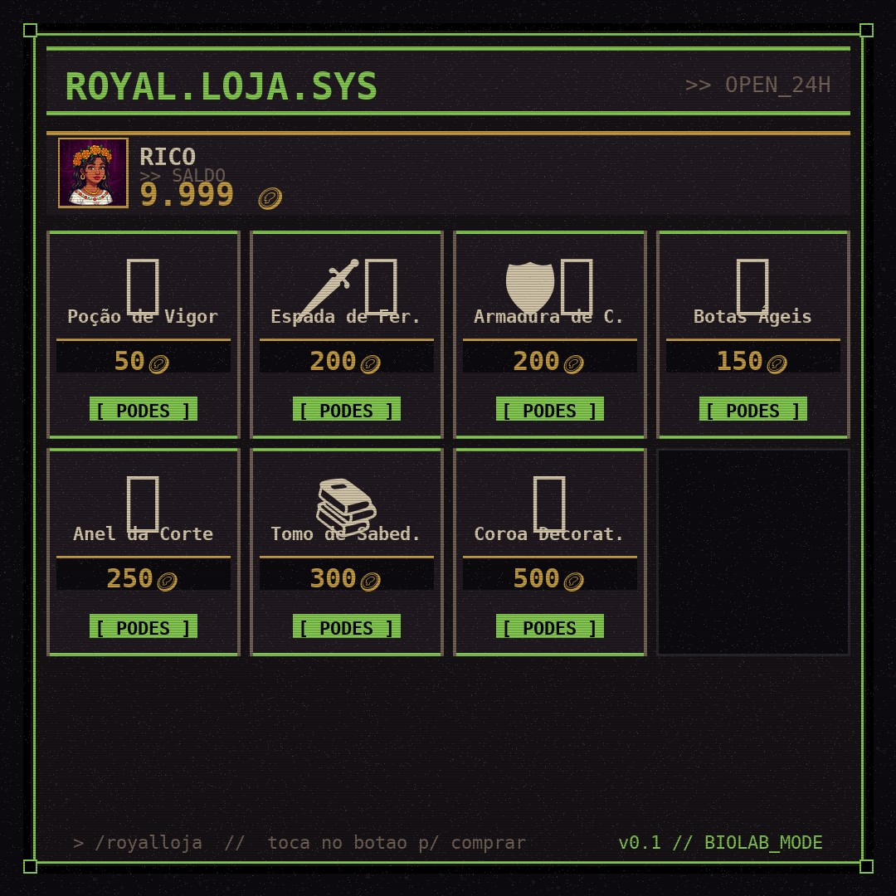<br><sub><b>Loja</b></sub></td>
<td align="center">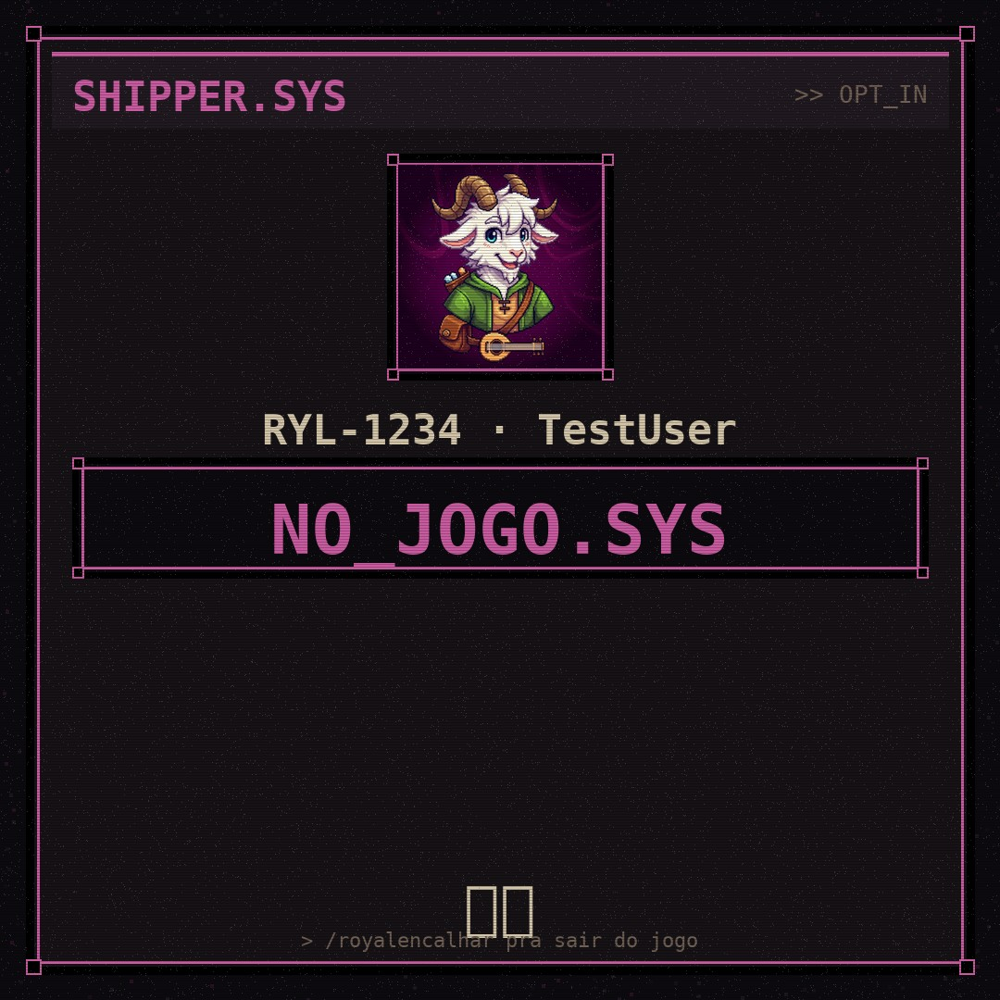<br><sub><b>Shipper</b></sub></td>
</tr>
</table>
</div>

---

<div align="center">

### 💍 Casórios (Shipper) — bônus

O bot **shippa** o grupo sozinho **3× por dia**, escolhendo o par com maior **afinidade**.
A afinidade cresce com a convivência: `responder (+6)` · `mencionar (+4)` · `estar ativo na mesma
janela de 3 min (+1)`. Casamento ativo dá **+10% de XP por 14 dias** e os espectadores votam ❤️/🤮.

<table>
<tr>
<td align="center">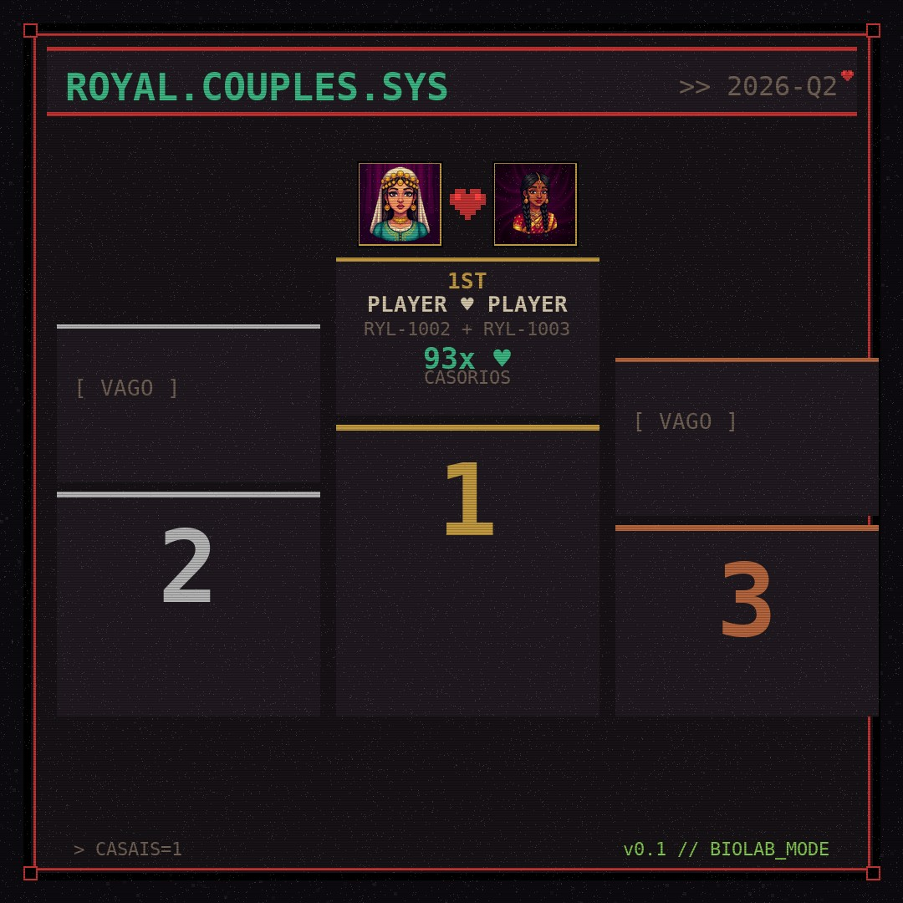</td>
<td align="center">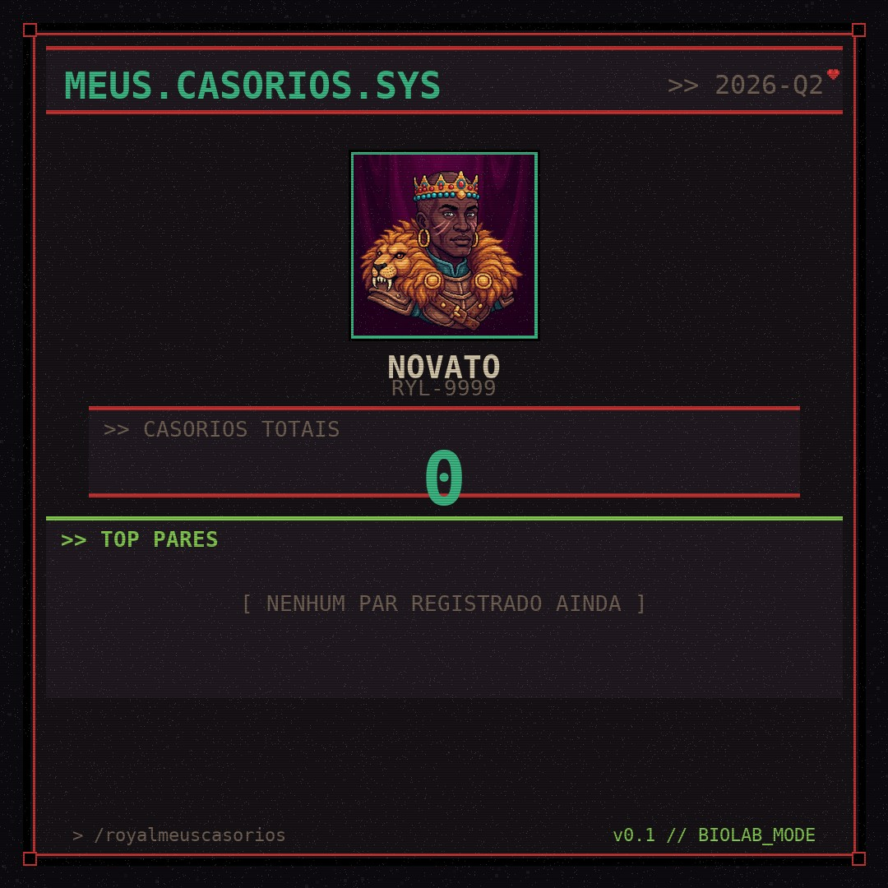</td>
</tr>
</table>

</div>

---

<div align="center">

## ⚙️ Sob o capô

Bot **worker** em **Python 3.12** com **aiogram (Bot API 10)** · persistência em **SQLite** ·
cartões renderizados em **Pillow puro** (sem navegador headless) · deploy como serviço contínuo.

<br>

*Projeto privado. Sem licença pública declarada.*

**👑 RPG — Royal para Geeks** · *o reino vive enquanto vocês conversam.*

</div>
